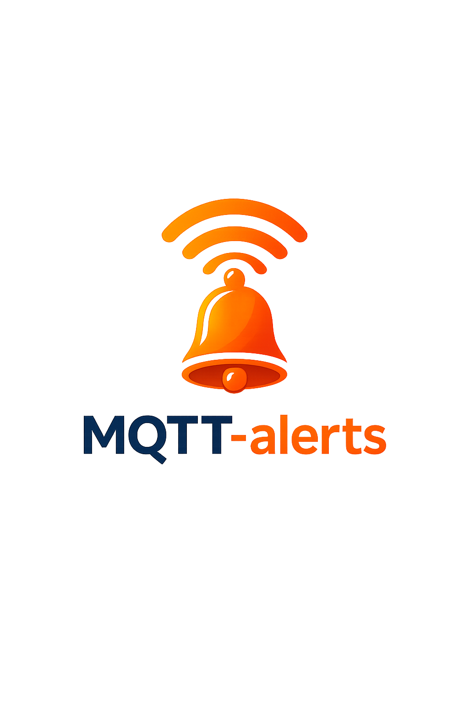

# mqtt-alerts

[](https://github.com/tvallas/mqtt-alerts/actions/workflows/ci.yml)
[](https://github.com/tvallas/mqtt-alerts/actions/workflows/docker.yml)
[](https://github.com/tvallas/mqtt-alerts/actions/workflows/trivy.yml)
[](https://pypi.org/project/mqtt-alerts/)
[](https://github.com/tvallas/mqtt-alerts/blob/master/pyproject.toml)
[](LICENSE)

<p align="center">
  
</p>

`mqtt-alerts` is a general-purpose MQTT alerting service. It subscribes to MQTT topics, evaluates threshold rules with hold times and hysteresis, persists alert state, and sends notifications through pluggable backends.

It works with `mtr2mqtt`, but it is not tied to `mtr2mqtt`. Any publisher that sends JSON payloads to MQTT can use this service.

## Key Features

- Multiple independent rules per sensor topic
- Rule hold durations (`for`) and hysteresis support
- Persistent alert lifecycle: `pending`, `firing`, `acknowledged`, `resolved`
- SQLite-backed state and restart-safe acknowledgement tracking
- Pluggable notification backends: `telegram`, `ntfy`, `pushover`
- Automatic recovery notifications
- Outbound-only acknowledgement polling (no public webhook required)

## Supported Backends

- `telegram`: push notifications with acknowledgement buttons (polled via Bot API)
- `ntfy`: outbound push notifications
- `pushover`: push notifications with emergency receipt acknowledgement support

## Documentation

- [Documentation index](docs/README.md)
- [Configuration guide](docs/configuration.md)
- [Notification backends](docs/backends.md)
- [Examples](docs/examples.md)
- [Deployment](docs/deployment.md)
- [Development](docs/development.md)

## Quick Start

Install:

```sh
pip install mqtt-alerts
```

Run:

```sh
mqtt-alerts --config sample_config.yml
```

Container:

```sh
docker run --rm \
  -v "$(pwd)/sample_config.yml:/config/config.yml:ro" \
  -v "$(pwd)/state:/state" \
  tvallas/mqtt-alerts:latest \
  --config /config/config.yml
```
